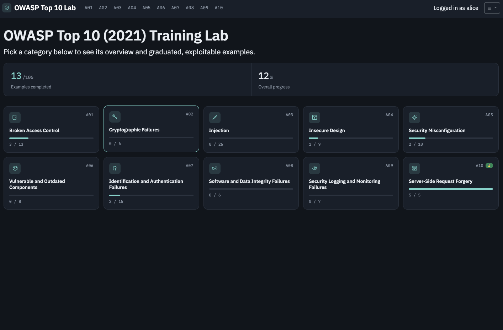
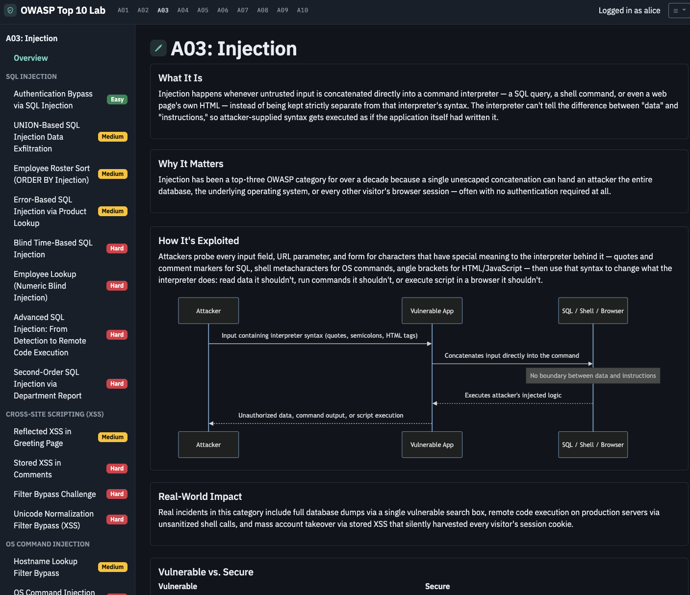
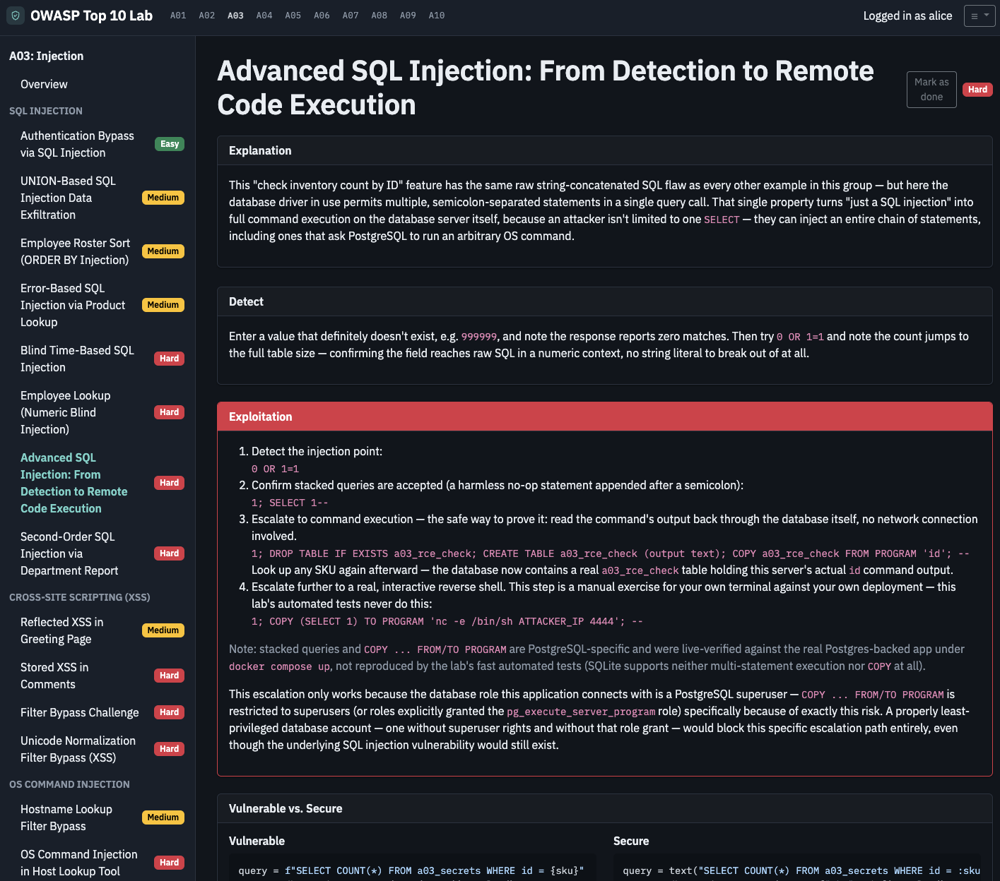

# OWASP Top 10 Training Lab

> ⚠️ **This application is intentionally vulnerable.** It exists to teach the OWASP
> Top 10 (2021) by letting you exploit real, working vulnerabilities in a safe,
> disposable environment — modeled after OWASP WebGoat, Juice Shop, and DVWA.
> **Never expose this application to an untrusted network or the public internet.**
> Run it only on `localhost` / an isolated Docker network, on a machine you control,
> with no sensitive data anywhere near it.

## What this is

A self-contained Flask + PostgreSQL web app. The top navigation lists each OWASP
Top 10 category; each category has an Overview page (what the vulnerability class
is, why it matters, how it's exploited, real-world impact) plus multiple graduated
examples (Easy → Medium → Hard) that are genuinely exploitable, not simulated.

Currently implemented, by category:

- **A01 Broken Access Control** — IDOR, missing function-level authorization, mass
  assignment / role escalation, IDOR on a password-change API, CSRF-based
  email-address takeover, CSRF via token presence-only validation, arbitrary file
  read via document download, path traversal filter bypass via absolute path, IDOR
  via a wildcard pattern-matched lookup, an unvalidated open redirect, an
  open-redirect allowlist bypass via domain suffix, HTTP parameter pollution
  enabling role escalation, and path traversal via an unsanitized avatar-upload
  filename.
- **A02 Cryptographic Failures** — leaked credential dump, weak ECB encryption,
  predictable password-reset token, reset token leaked via the Referer header,
  reset token leaked in an API response, and a predictable API key via a
  time-seeded PRNG.
- **A03 Injection** — SQL injection auth bypass, UNION-based exfiltration,
  reflected XSS, blind time-based SQLi, error-based SQLi, OS command injection,
  SQL injection escalating to remote code execution, stored XSS, XXE file
  disclosure, XXE SSRF, CSS attribute-selector data exfiltration via a profile
  theme, argument injection via an unsanitized tar export, CSV formula injection
  via comment export, Unicode normalization filter bypass, LFI-to-SSTI via an
  unsanitized snippet include, second-order SQL injection via a stored department
  value, and stored XSS via an untrusted SVG upload.
- **A04 Insecure Design** — unlimited coupon reuse, negative-quantity price
  manipulation, multi-step checkout bypass, password-reset poisoning via the Host
  header, free shipping via a client-trusted flag, overselling with no
  stock-limit check, discount-code stacking via parameter pollution, premium
  access persisting after cancellation, and a store-credit rounding exploit.
- **A05 Security Misconfiguration** — exposed database backup, directory listing,
  verbose error disclosure, permissive CORS with credentials, exposed debug
  console, forgotten admin panel with default credentials, clickjacking on a
  sensitive action page, CORS null-origin whitelisting, CORS wildcard-origin
  internal-network pivot, and CORS origin-allowlist regex bypass.
- **A06 Vulnerable and Outdated Components** — component version disclosure,
  outdated JS library detection, jQuery DOM XSS via a real CVE, jQuery XSS
  chained to session-token theft, Lodash prototype pollution via a real CVE,
  prototype pollution bypassing a client-side access check, remote code
  execution via a real, unpatched ImageMagick build (CVE-2016-3714,
  "ImageTragick"), and that same RCE bypassing a naive image-extension allowlist.
- **A07 Identification and Authentication Failures** — no rate limiting enables
  brute force, credential stuffing across multiple accounts, session identifier
  exposed in a URL, session not invalidated on logout, full session fixation,
  bypassable multi-factor authentication, an MFA backdoor magic value, an MFA
  code leaked through a debug API field, MFA code reuse, MFA code not bound to
  its session, MFA brute force with no rate limiting, password reset via
  username-whitespace collision, account takeover via Unicode normalization,
  password reset silently disabling 2FA, and CSRF on disabling 2FA.
- **A08 Software and Data Integrity Failures** — pickle cart tampering, pickle
  deserialization RCE, unsigned plugin content trust, unsigned plugin
  installation leading to RCE, unchecked signature on a preferences cookie, and
  JWT alg:none signature bypass.
- **A09 Security Logging and Monitoring Failures** — failed login attempts never
  logged, high-value admin action with no audit trail, sensitive data leaked
  into log files, unauthenticated log file exposure, no alert threshold for
  repeated failures, attack signature logged but never flagged, and an audit
  log forged via an unescaped display name.
- **A10 Server-Side Request Forgery** — webhook tester reaches internal metadata
  endpoint, same fetcher enables internal port scanning, PDF generator reads
  local files via a `file://` URL, alternate IP representation bypasses a naive
  blocklist, and open redirect bypasses a trusted-domain allowlist.

See the [category summary](#category-summary) table below for the full list of
examples with their difficulty ratings.

## Screenshots

| Dashboard | Category overview | Example walkthrough |
| --- | --- | --- |
| [](docs/screenshots/dashboard.png) | [](docs/screenshots/category-overview.png) | [](docs/screenshots/example-page.png) |

## Quick start

```bash
git clone https://github.com/jozeta/owasp-lab.git
cd owasp-lab
cp .env.example .env      # edit SECRET_KEY if you like; defaults work for local use
docker compose up --build
```

The first build compiles a vendored, intentionally-unpatched ImageMagick release
from source (for the A06 ImageTragick example) and takes noticeably longer than a
typical rebuild — later rebuilds are fast again since Docker caches that layer.

Then open <http://127.0.0.1:5001>. The database auto-seeds on first run with
synthetic accounts (`alice`, `bob`, `carol`, `admin`) — no real data is ever used.

## Settings

Visit **Settings** in the top nav to:

- Toggle whether example pages show their **Explanation** text.
- Toggle whether example pages show step-by-step **Exploitation** instructions.
- **Enable the scoring system** — award points on completion (30 Hard / 20 Medium /
  10 Easy), reduced by however many progressive hints you request first.
- **Reset the lab** to its clean seeded state (useful between training sessions or
  between developers sharing the same instance).

All toggles are global and stored in the database — they affect every example page
immediately for every visitor. Hiding the teaching text never disables the underlying
vulnerability; it only conceals the walkthrough, so you can attempt exploitation blind.

When the scoring system is enabled, step-by-step exploitation instructions are always
hidden (regardless of the exploit-instructions toggle's own setting) — hints become the
only guidance mechanism. Each example offers 3-5 hints, from a vague nudge toward the
right technique to a fully explicit payload; each hint you reveal permanently reduces
the points that example can award once you mark it done, and points are locked in at
the moment you do. Your running score is shown in the top nav and on the home page.

Reset lab restores database state (seeded accounts, secrets, comments, orders, your
example-completion progress, etc.) to its clean starting point. Per-browser example
state — like a demo cart or coupon count stored only in your session — isn't part of
that database and is cleared by that example's own "Start over" control (where
provided) or by clearing your browser's cookies for this site.

If you're running under Docker and your Postgres data volume was created before a
schema change landed (for example, an older checkout without the A07 MFA examples'
`pending_mfa_code` column, or without per-user progress tracking's `user_id` column
on `example_progress`), clicking "Reset lab" in the UI reseeds rows but won't add
new columns to already-existing tables. In that case, run
`docker compose down -v && docker compose up -d` once to drop the old volume and let
the app recreate the schema from scratch, then use "Reset lab" as normal afterward.

## More pages

- **Home** (`/`) — your own progress across every example, overall and per category,
  plus your running score when the scoring system is enabled. Progress is tracked
  per user: pick a user via the top nav's "Switch user" link (or any gated example
  page) to have your completions and hints counted under your own name. An
  anonymous visitor sees an empty dashboard with a prompt to pick a user. The
  Settings toggles above remain global and shared by every visitor, unlike
  progress.
- **Tools** (`/tools`) — what tools are useful for which kinds of exercises, with
  download links.
- **About** (`/about`) — what this app is, its infrastructure, and its safety model.
- A 🌓 **Theme** button in the top nav toggles dark mode; the choice is remembered
  per browser.

## Category summary

| Category | Status | Examples |
| --- | --- | --- |
| A01 Broken Access Control | Implemented | IDOR (Easy), IDOR on Password-Change API (Medium), Hidden Admin Panel (Medium), Mass Assignment Role Escalation (Hard), Account Takeover via CSRF (Email Change) (Medium), CSRF via Token Presence-Only Validation (Medium), Arbitrary File Read via Document Download (Medium), Path Traversal Filter Bypass via Absolute Path (Hard), IDOR via Wildcard Pattern-Matched Lookup (Medium), Unvalidated Open Redirect (Medium), Open Redirect Allowlist Bypass via Domain Suffix (Hard), HTTP Parameter Pollution Role Escalation (Hard), Avatar-Upload Path Traversal (Medium) |
| A02 Cryptographic Failures | Implemented | Leaked Credential Dump (Easy), Weak Encryption / ECB Mode (Medium), Predictable Password Reset Token (Hard), Reset Token Leaked in API Response (Easy), Reset Token Leaked via Referrer Header (Medium), Predictable API Key via Time-Seeded PRNG (Hard) |
| A03 Injection | Implemented | SQLi Auth Bypass (Easy), UNION SQLi Exfiltration (Medium), Error-Based SQLi (Medium), Reflected XSS (Medium), Blind Time-Based SQLi (Hard), OS Command Injection (Hard), SQLi to RCE (Hard), Stored XSS (Hard), XXE File Disclosure (Easy), XXE SSRF (Hard), CSS Attribute-Selector Data Exfiltration (Hard), Argument Injection via tar Export (Hard), CSV Formula Injection (Medium), Unicode Normalization Filter Bypass (Hard), LFI-to-SSTI via Snippet Include (Hard), Second-Order SQLi via Department Report (Hard), Stored XSS via SVG Upload (Hard) |
| A04 Insecure Design | Implemented | Unlimited Coupon Reuse (Easy), Free Shipping via Client-Trusted Flag (Easy), Negative Quantity Price Manipulation (Medium), Overselling — No Stock-Limit Check (Medium), Discount Code Stacking via Parameter Pollution (Medium), Multi-Step Checkout Bypass (Hard), Password Reset Poisoning via Host Header (Hard), Premium Access Persists After Cancellation (Medium), Store-Credit Rounding Exploit (Hard) |
| A05 Security Misconfiguration | Implemented | Exposed Database Backup File (Easy), Directory Listing Exposed (Easy), Verbose Error Message Disclosure (Medium), Permissive CORS with Credentials (Medium), CORS: Null Origin Whitelisted (Medium), CORS: Wildcard Origin, Internal Network Pivot (Medium), CORS: Origin Allowlist Regex Bypass (Hard), Exposed Debug Console (Hard), Forgotten Admin Panel with Default Credentials (Hard), Clickjacking on a Sensitive Action Page (Easy) |
| A06 Vulnerable and Outdated Components | Implemented | Component Version Disclosure (Easy), Outdated Vulnerable JS Library Detection (Easy), jQuery DOM XSS via Vulnerable htmlPrefilter (Medium), Lodash Prototype Pollution via _.defaultsDeep() (Medium), jQuery DOM XSS Chained to Session Token Theft (Hard), Prototype Pollution Bypasses a Client-Side Access Check (Hard), ImageTragick RCE via Image Upload (Medium), ImageTragick Bypasses an Image-Extension Allowlist (Hard) |
| A07 Identification and Authentication Failures | Implemented | No Rate Limiting Enables Brute Force (Easy), Credential Stuffing Across Multiple Accounts (Medium), Session Identifier Exposed in URL (Easy), Session Not Invalidated on Logout (Medium), Session Fixation (Hard), MFA Bypass via Magic/Null Value (Easy), MFA Code Leaked to Client (Easy), MFA Code Reusability (Medium), MFA Brute-Force (Medium), Bypassable Multi-Factor Authentication (Hard), MFA Code Not Bound to Session (Hard), Password Reset Silently Disables 2FA (Medium), Password Reset via Username Collision (Hard), Account Takeover via Unicode Normalization (Hard), CSRF on Disabling 2FA (Medium) |
| A08 Software and Data Integrity Failures | Implemented | Pickle Cart Tampering (Easy), Unsigned Plugin Content Trust (Medium), Unchecked Signature on Preferences Cookie (Easy), JWT alg:none Signature Bypass (Medium), Pickle Deserialization RCE (Hard), Unsigned Plugin Installation Leads to RCE (Hard) |
| A09 Security Logging and Monitoring Failures | Implemented | Failed Login Attempts Never Logged (Easy), High-Value Admin Action With No Audit Trail (Medium), Sensitive Data Leaked Into Log Files (Easy), Unauthenticated Log File Exposure (Hard), No Alert Threshold for Repeated Failures (Medium), Attack Signature Logged But Never Flagged (Hard), Audit Log Forged via Unescaped Display Name (Medium) |
| A10 Server-Side Request Forgery | Implemented | Webhook Tester Reaches Internal Metadata Endpoint (Easy), Same Fetcher Enables Internal Port Scanning (Medium), PDF Generator Reads Local Files via file:// URL (Easy), Alternate IP Representation Bypasses a Naive Blocklist (Medium), Open Redirect Bypasses a Trusted-Domain Allowlist (Hard) |

## Safety model

- The app container binds only to `127.0.0.1` on the host (`docker-compose.yml`
  publishes `127.0.0.1:5001:5000`); PostgreSQL publishes no host port at all.
- The app container runs as a non-root user (`appuser`).
- All data is synthetic and regenerated by "Reset lab" — there is no real user data.
- A persistent warning banner is shown in the UI at all times (dismissible for the
  current browser session only).
- If the app itself breaks (an unhandled error blocks normal navigation) and you
  can't reach Settings through the UI, visit `/force-reset` directly — it resets
  the database and clears your session without depending on any other part of
  the app rendering correctly.

## Development

```bash
python -m venv .venv
.venv/bin/pip install -r requirements.txt
.venv/bin/pytest tests/ -v
```

Tests run against an in-memory SQLite database and do not require Docker or Postgres.

## License

MIT — see [LICENSE](LICENSE). Like every OWASP-style training lab, this code is
intentionally insecure; do not reuse any of it in a real application.
